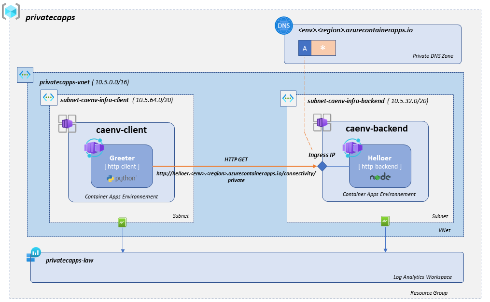
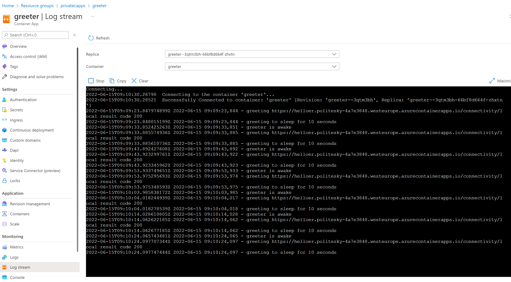
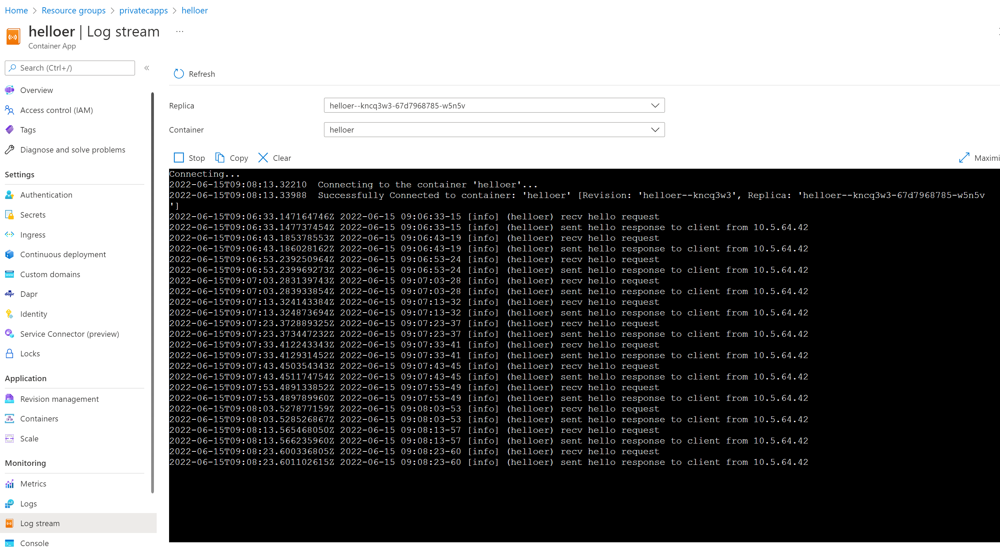

# az-capps-private

## Intro

The Azure Container Apps is a new and quite interesting feature that provides a fully managed, ready to use, containerized serverless environment for your applications.

This service is a highly valuable player when it comes to developing cloud native applications or simply accelerating your application modernization process by removing all operational dependencies on the Kubernetes infrastructure and underlying skills.
The Azure Container Apps provides both public and fully private connectivity and can therefore fit pretty much any of the enterprise contexts.

This repo demonstrates the deployment of a set of applications in a fully private mode where all the traffic flows though your Azure Vnets.
Due to the freshness of the service GA, the IaC framework coverage for Azure Container Apps is quite limited as you can only use Azure ARM, CLI or Bicep to automate the deployment.

The current repo provides the Bicep implementation and will be updated when additional frameworks (Terraform and eventually Pulumi) will extend the their coverage in order to provide the bindings for this service. 

## Architecture

The demonstrator deploys two Container Apps communicating via private connectivity over your VNet infrastructure. 

The following diagram provides a high level overview of the demonstrator: 



### Backend service

The **caenv-backend** environment hosts the **[helloer](https://github.com/zlatko-ms/helloer)** application, a simple nodejs app that responds to http requests.

The environment is injected in a specific subnet and connected to the **privatecapps-law** Log Analytics workspace in order to provide diagnostic settings and log centralization.

The application exposes an ingress via the environment ingress static IP. In order to reach your application ingress, the caller application must use the ingress FQDN as detailed in the following [doc](https://docs.microsoft.com/en-us/azure/container-apps/ingress?tabs=bash#ip-addresses-and-domain-names) . 

Note that hitting the ILB behind the ingress with the IP address will not work as the hostname is used to route the traffic to the correct application within the environment.

Hence we need to set up a **private DNS zone** with a **wildcard ('*') A record** pointing to the environment ingress static IP. The wildcard is justified by the fact that a given environment can have several applications, each with its own ingress, served from the same Internal Load Balancer. 

The final app flow routing will use the hostname which is expected to be the same as the application name (in our case helloer.envSystemName.region.azurecontaierapps.io ).

### Client service

The **caenv-client** environment hosts the **[greeter](https://github.com/zlatko-ms/pgreeter)** applicaion, a tiny python script that performs periodical HTTP GET requests to the backend.

The environment is injected in a specific subnet and connected to the same **privatecapps-law** Log Analytics workspace to provide diagnostic settings and log centralization.

This Greeter application does not provide any ingress, so there is no need to set up a DNS zone for this environment.

## Code Walkthough

The code tree is classic, the [main.bicep](https://github.com/zlatko-ms/az-capps-private/blob/main/src/bicep/main.bicep) providing the definitions of the demonstrator and using specific [modules](./src/bicep/modules/) to deploy the underlying infrastructure services ( CA Envs, Apps, DNS, Log Analytics)

### VNet Definition

The network infrastructure is defined by the two variables located in [main.bicep](https://github.com/zlatko-ms/az-capps-private/blob/main/src/bicep/main.bicep#L12). If necessay update the ranges in order to fit your Azure environnement constraints.

The implementation of the VNet and underlying subnets is perfromed by the dedicated [vnet.bicep](https://github.com/zlatko-ms/az-capps-private/blob/main/src/bicep/modules/vnet.bicep) module.

The network module **outputs** the identifiers of the created [Vnet](https://github.com/zlatko-ms/az-capps-private/blob/main/src/bicep/modules/vnet.bicep#L40) as well as of the [subnets](https://github.com/zlatko-ms/az-capps-private/blob/main/src/bicep/modules/vnet.bicep#L42) that will be required to wire up the Vnet injection and the DNS zone.

### Container Apps Environnements

The container apps environnements are implemented in the [caenv.bicep](./src/bicep/modules/caenv.bicep).

The vnet injection is set up by providing the adequate subnet id to the environnement module as illustrated in the [main.bicep](https://github.com/zlatko-ms/az-capps-private/blob/main/src/bicep/main.bicep#L84) for the **caenv-backend**. A similar assignation is provided for the **caenv-client** environnement at [main.bicep](https://github.com/zlatko-ms/az-capps-private/blob/main/src/bicep/main.bicep#L114). The identifiers of the 

The envrionnement is attached to the Log Analytics workspace by setting up the log analytics [clientid](./src/bicep/main.bicep#L77) and [shared key](https://github.com/zlatko-ms/az-capps-private/blob/main/src/bicep/main.bicep#L78). For sake of "technical clarity" we used the output of the [law module](./src/bicep/modules/law.bicep#L31-32) to get the keys. In a production environnement you should consider storing the secrets in a secured storage such an Azure Key Vault.

### Private DNS for Backend Service

In order to set up the DNS zone we'll need the VNet Id, the environnement domain as well as the environnement static IP assigned on creation time.

The domain name is provided by the backend service application environnement as an [output](https://github.com/zlatko-ms/az-capps-private/blob/main/src/bicep/modules/caen.bicep#L44), assigned from [main.bicep](https://github.com/zlatko-ms/az-capps-private/blob/main/src/bicep/main.bicep#L95) and used in the dedicated [caenvdns.bicep](https://github.com/zlatko-ms/az-capps-private/blob/main/src/bicep/modules/caenvdns..bicep#L22) module.

The static Ip is used to set up the wildcar A record in, assigned from [main.bicep](https://github.com/zlatko-ms/az-capps-private/blob/main/src/bicep/main.bicep#L96) and used in [caenvdns.bicep](https://github.com/zlatko-ms/az-capps-private/blob/main/src/bicep/modules/caenvdns.bicep#L48).

The VNet is provided as the output of the [vnet.bicep](https://github.com/zlatko-ms/az-capps-private/blob/main/src/bicep/modules/vnet.bicep#L44) module, assigned from [main.bicep](https://github.com/zlatko-ms/az-capps-private/blob/main/src/bicep/main.bicep#L97) and used in the [caenvdns.bicep](https://github.com/zlatko-ms/az-capps-private/blob/main/src/bicep/modules/caenvdns.bicep#L35) module.

### Applications

The Container Apps are defined in [main.bicep](https://github.com/zlatko-ms/az-capps-private/blob/main/src/bicep/main.bicep#L118-L220) and realized by the dedicated [ca.bicep](https://github.com/zlatko-ms/az-capps-private/blob/main/src/bicep/modules/ca.bicep) module.

The **helloer** application ingress definition can be found in [main.bicep](https://github.com/zlatko-ms/az-capps-private/blob/main/src/bicep/main.bicep#L130) while the **greeter** has no ingress.

The **greeter** application requires the URL to hit to be provided as a GREETER_URL environnement variable. The value of the url is computed at [main.bicep](https://github.com/zlatko-ms/az-capps-private/blob/main/src/bicep/main.bicep#L184) and assigned at [main.bicep](https://github.com/zlatko-ms/az-capps-private/blob/main/src/bicep/main.bicep#L207)


## Usage

### Requirements

In order to deploy the demo project you'll need the following dependencies : 

* [Azure CLI](https://docs.microsoft.com/en-us/cli/azure/install-azure-cli-linux)
* [Azure CLI Bicep extension](https://docs.microsoft.com/en-us/azure/azure-resource-manager/bicep/install) 
* GNU Make
* GitHub project clone

We advise using a Linux shell or WSL on Windows as it was used to build the project. However any OS with the dependencies installed will work as well.

If you have trouble installing GNU Make (i.e you are probably using a Windows shell), you can simply type the commands referenced in the [Makefile]((https://github.com/zlatko-ms/az-capps-private/blob/main/src/bicep/Makefile) for each rule. Just make sure to remove the @ prefix from each command line.

### Deployement

Start by connecting to azure from the command line : 

```bash 
az login
```

To deploy the project with default values for the resource group name and region simply issue the following commands : 

```bash 
cd src/bicep
make
```

If you want to customize the location or the resource group name you can use the following : 

```bash 
cd src/bicep
make stackName=<myRGName> location=<myAzureRegion>
```

### Using within the resource group scope

The scope of the bicep project is the subscription and therfore requires the user to have the necessary priviledges on the subscription level.

If you are not in that situation, then you it *should* be possible to deploy it on a ressource group level by : 

* changing the targetScope to 'resourceGroup' in the [main.bicep](https://github.com/zlatko-ms/az-capps-private/blob/main/src/bicep/main.bicep#L1)
* commenting the resource group creation from [main.bicep](https://github.com/zlatko-ms/az-capps-private/blob/main/src/bicep/main.bicep#L40-L45)
* changing the command lines in the [Makefile](https://github.com/zlatko-ms/az-capps-private/blob/main/src/bicep/Makefile) to deploy on an existing resource with the help of this [doc](https://docs.microsoft.com/en-us/azure/azure-resource-manager/bicep/deploy-to-resource-group)

### Insights

Once the deployement process is finished, start by taking a tour on the created resource group and you shoud see an output similar to the following : 

Then take a look at the *Log Stream* of the **Greeter** application, that should look similar to the following : 



Then take a look at the *Log Stream* of the **Helloer** application, that should look similar to this : 



Note the trace showing the calls : 

```bash
2022-06-15 15:55:01-07 [info] (helloer) recv hello request
2022-06-15 15:55:01-13 [info] (helloer) sent hello response to client from 10.5.64.42
```

It indicates the request is adressed from a client with IP 10.5.64.42, i.e. the request origins from the **subnet-caenv-infra-client** (10.5.64.0/20) where the **caenv-client** has been injected.

Additional inisights on your apps and infra can be found from the log analytics workspace. 

In order to check system logs, go to the **Logs** entry of any of the application and explore the available events by entering the simplest possible KQL query : 

```kql
ContainerAppSystemLogs_CL 
```

In order to check and explore the applications logs, which you already looked at using the **Log Stream**, go to the **Log Stream** entry of any of the application and explore the available events by the simplest possible KQL query : 

```kql
ContainerAppConsoleLogs_CL 
```

You can then refine both queries using the [KQL language](https://docs.microsoft.com/en-us/azure/data-explorer/kql-quick-reference)

The **Metrics** tab will scope Azure Monitor to your application to provide a quick way of building your application monitoring dashboards.

And if you're interessted by the underlying infrastructure implementation, take a look at your vnet and check the connected devices, you'll see the injected Kuberntes nodes and ILBs, wich can give you an indea on how the service is built.

### Cleanup

To delete all the deployed ressources simply issue the following commands : 

```bash 
cd src/bicep
make clean
```

If you have customized the resource group name, then please make sure it is provided as a parameter : 

```bash 
cd src/bicep
make stackName=<myRGName> clean
```
## Project Roadmap

At the current stage this repo demonstrates a simple setup and focuses on the network connectivity.

Ideally we'd like to to cover the following areas as well : 

* network filtering with azure firewall
* hybrid public/private connectivity
* usage of managed indentities to access azure services

If you're interrested in contributing in any of the above mentionned areas, please reach out ! 


## Usefull Readings

* [Azure Container Apps Overview](https://docs.microsoft.com/en-us/azure/container-apps/overview)
* [Azure Container Apps ARM/Biceps reference](https://docs.microsoft.com/en-us/azure/templates/microsoft.app/containerapps?tabs=bicep)


